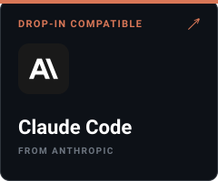
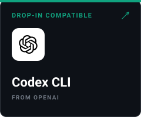
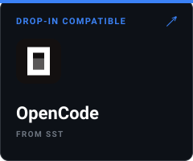
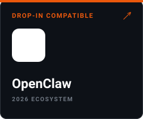

# 📝 MDA Open Spec — Markdown for Agent

> A Markdown superset for agent-facing documents. **One source, many targets** — compile into the `.md` files every major agent runtime already loads. **Tamper-evident at load** — every artifact carries a reproducible content digest, and signed artifacts carry Sigstore-anchored signatures, so neither the agent loading the doc nor the human reviewing it has to trust an unsigned blob.

[](https://github.com/sno-ai/mda/releases/tag/v1.0.0-rc.3)
[](https://github.com/sno-ai/mda/blob/main/LICENSE)
[](https://mda.sno.dev)
[](https://github.com/sno-ai/mda/stargazers)

**Read in other languages:** **English** · [中文](docs/readme/README.zh-CN.md) · [Deutsch](docs/readme/README.de.md) · [Español](docs/readme/README.es.md) · [Français](docs/readme/README.fr.md) · [Русский](docs/readme/README.ru.md) · [한국어](docs/readme/README.ko.md) · [日本語](docs/readme/README.ja.md) · [हिन्दी](docs/readme/README.hi.md)

## What MDA is

Until now, you shipped the same skill four times. Once as `SKILL.md` for the agentskills.io runtimes. Once as `AGENTS.md` for the AAIF ecosystem. Once as `MCP-SERVER.md` with a sidecar JSON. Once as `CLAUDE.md`. Same content, four frontmatter shapes. Update one, forget the others, and a month in, the four files have quietly drifted into four slightly different instruction files.

You write one `.mda`. The compiler emits the rest.


```
                ┌─────────────────────────┐
                │   <name>.mda  (source)  │   ← MDA superset
                └────────────┬────────────┘
                             │  mda compile
                             ▼
   ┌─────────────────────────────────────────────────────────┐
   │ <name>/SKILL.md     (+ scripts/, references/, assets/)  │
   │ AGENTS.md                                               │
   │ <name>/MCP-SERVER.md  (+ mcp-server.json sidecar)       │
   │ CLAUDE.md                                               │
   └─────────────────────────────────────────────────────────┘
                       drop-in compatible
```

## Compatibility

**Write your skill once. It drops into every major agent runtime — unchanged.**

<a href="compat/claude-code/"></a>
<a href="compat/codex-cli/"></a>
<a href="compat/opencode/"></a>
<a href="compat/hermes/"></a>
<a href="compat/openclaw/"></a>

Five SKILL.md runtimes verified end-to-end with reproducible install kits in [`compat/`](compat/). Compiled `AGENTS.md` artifacts also drop into the AAIF ecosystem (Codex, Copilot, Cursor, Windsurf, Amp, Devin, Gemini CLI, VS Code, Jules, Factory), and at the documentation level into skills.sh and other 2026 SKILL.md consumers.

And those four files can't say who signed them. The agent loading `SKILL.md` has no way to verify the content matches what you wrote, and the curator reviewing `AGENTS.md` has no way to know whose hands have been on it between merge and load. The standard frontmatter shapes have nowhere to put a content digest or a signature, so the trust decision quietly falls back to "we trust the repo, somehow."

MDA carries a JCS-canonicalized `integrity.digest` and DSSE-enveloped, Sigstore-anchored `signatures[]` in the frontmatter itself. Both sides — the agent at load time and the human at review time — can make a real trust decision against the artifact in hand, not against a feeling about the repo. Tamper-evidence and signer verification ship in the contract, not as a later bolt-on.


`.mda` adds three things on top of standard Markdown. All of them optional.

1. **Rich YAML frontmatter.** Beyond the open-standard `name` and `description` baseline, MDA carries `doc-id`, `version`, `requires`, `depends-on`, `relationships`, and `tags`. Agent-aware tools use these for routing, dependency resolution, and graph traversal. See [`spec/v1.0/02-frontmatter.md`](spec/v1.0/02-frontmatter.md) and [`spec/v1.0/10-capabilities.md`](spec/v1.0/10-capabilities.md).
2. **Typed footnote relationships.** Standard Markdown footnotes whose payload is a JSON object: `parent`, `child`, `related`, `cites`, `supports`, `contradicts`, `extends`. Mirrored to `metadata.mda.relationships` in body order on compile. See [`spec/v1.0/03-relationships.md`](spec/v1.0/03-relationships.md).
3. **Cryptographic identity.** A JCS-canonicalized `integrity` digest plus DSSE-enveloped, Sigstore-anchored `signatures[]`. The compiled `.md` carries reproducible tamper detection without bolting it on later. See [`spec/v1.0/08-integrity.md`](spec/v1.0/08-integrity.md) and [`spec/v1.0/09-signatures.md`](spec/v1.0/09-signatures.md).

A `.mda` source with only the open-standard frontmatter compiles unchanged into a `.md`. Use as much or as little of MDA as your project needs.

## Why this exists

The honest version. I kept shipping the same skill four times. Same content, four wrappers. Each runtime had its own opinions about what frontmatter belonged at the top and what counted as vendor-specific. The third or fourth time I copy-pasted a paragraph between `SKILL.md` and `AGENTS.md` and then watched them drift, I started writing this.

The thing is, the duplication isn't the worst part. The worst part is what you can't say in any of those formats. You can't say "this skill depends on that one, version `^1.2.0`, with this content digest." You can't say "this file was signed by this identity at this Rekor index." You can't say "the relationship between this document and that one is `supports`, not `cites`." There's nowhere to put that information, so it sits in prose, where neither agents nor humans can act on it reliably.

MDA puts those things in the frontmatter and footnotes, in shapes a JSON Schema can validate. The Markdown body still renders. The standard fields still load. Everything new is optional. That's the whole pitch.

For the long version, two documents go deeper. Both trace every claim back to a section of the spec, and both call out current ecosystem gaps inline. Read them if you're deciding whether to adopt.

- [**`docs/v1.0/ai-agent-core-value.md`**](docs/v1.0/ai-agent-core-value.md) — five points framed for runtimes, harnesses, validators, and dispatchers. What MDA gives an agent at load time: structured `requires` for typed dispatch, verifiable trust at load, machine-readable graph edges, filename-based one-lookup target dispatch, and the same validation contract for agent-authored and compiler-emitted output.
- [**`docs/v1.0/human-curator-user-core-value.md`**](docs/v1.0/human-curator-user-core-value.md) — six points framed for the people who write and curate agent-facing instruction libraries. What MDA gives an author at ship time: one source into multiple ecosystems, tamper-evidence and publisher attribution, machine-readable dependency graph and version pinning, LLM-mediated authoring without learning every runtime's frontmatter, smaller (not zero) vendor lock-in, and strict validation that catches almost-conformant artifacts before they ship.

## Three authoring modes

MDA artifacts may be produced three ways. They're equivalent under validation.

1. **Agent mode** — an AI agent writes the `.md` directly. The primary near-term use case.
2. **Human mode** — a human writes the `.md` directly, with standard hashing and DSSE-capable signing tools.
3. **Compiled mode** — an author writes a `.mda` source; the MDA compiler emits one or more `.md` outputs.

Whichever path you take, the artifact is judged against the same JSON Schema 2020-12 target schema and the same conformance suite. There's no second code path for "this came from an agent."

See [`docs/create-sign-verify-mda.md`](docs/create-sign-verify-mda.md) for the human and agent-authored paths without the reference CLI, and [`spec/v1.0/00-overview.md §0.5–§0.6`](spec/v1.0/00-overview.md) for the normative statement of priority and modes.

## Minimal example

`pdf-tools.mda`:

```yaml
---
name: pdf-tools
description: Extract PDF text, fill forms, merge files. Use when handling PDFs.
metadata:
  mda:
    doc-id: 38f5a922-81b2-4f1a-8d8c-3a5be4ea7511
    title: PDF Tools
    version: "1.2.0"
    tags: [pdf, extraction]
---

# PDF Tools

…
```

Compiles to `pdf-tools/SKILL.md`. The source already sits in the strict target shape, with every MDA-extended field nested under `metadata.mda.*`, so the compile is essentially a rename. More worked examples live in [`examples/`](examples/) and [`docs/mda-examples/`](docs/mda-examples/).

## The Open Spec

The normative MDA Open Spec lives at [**SPEC.md**](SPEC.md) → [`spec/v1.0/`](spec/v1.0/).

- [§00 Overview](spec/v1.0/00-overview.md) — terms, RFC 2119, P0 > P1 > P2 priority, three authoring modes, governance, versioning
- [§01 Source and output](spec/v1.0/01-source-and-output.md)
- [§02 Frontmatter](spec/v1.0/02-frontmatter.md)
- [§03 Relationships](spec/v1.0/03-relationships.md) — footnotes + `depends-on` + version/digest pinning
- [§04 Platform namespaces](spec/v1.0/04-platform-namespaces.md)
- [§05 Progressive disclosure](spec/v1.0/05-progressive-disclosure.md)
- [§06 Target schemas](spec/v1.0/06-targets/) — `SKILL.md`, `AGENTS.md`, `MCP-SERVER.md`, `CLAUDE.md`
- [§07 Conformance](spec/v1.0/07-conformance.md)
- [§08 Integrity](spec/v1.0/08-integrity.md)
- [§09 Signatures](spec/v1.0/09-signatures.md) — Sigstore OIDC default, did:web fallback
- [§10 Capabilities](spec/v1.0/10-capabilities.md) — `metadata.mda.requires`
- [§11 Implementer's Guide](spec/v1.0/11-implementer-guide.md) (informative)
- [§12 Sigstore tooling integration](spec/v1.0/12-sigstore-tooling.md) (informative)
- [§13 Trusted Runtime Profile](spec/v1.0/13-trusted-runtime.md) — production verification profile and trust policy

JSON Schemas live in [`schemas/`](schemas/) — `frontmatter-source`, `frontmatter-skill-md`, `frontmatter-agents-md`, `frontmatter-mcp-server-md`, `relationship-footnote`, `mda-trust-policy`, plus shared `_defs/` for `integrity`, `signature`, `requires`, `depends-on`, and `version-range`. Conformance fixtures and the validation runner live in [`conformance/`](conformance/) (`node scripts/validate-conformance.mjs`).

## Reference implementation

The TypeScript CLI lives in [`apps/cli/`](apps/cli/) (npm package: `@markdown-ai/cli`). The architecture spec is [`apps/cli/IMPL-SPEC.md`](apps/cli/IMPL-SPEC.md). The current release candidate is `v1.0.0-rc.3`, whose primary change is the shipped npm CLI. The final `1.0.0` lands when the CLI passes 100% of the conformance suite.

Use the CLI as an authoring, CI, and agent-side checking tool, not as an application runtime dependency. The clean boundary is simple: `@markdown-ai/cli` helps humans and agents create, validate, compile, canonicalize, and integrity-check MDA artifacts before they are trusted or shipped; runtime libraries should keep their own lightweight loaders and verifier hooks instead of shelling out to `mda`. An AI agent may still run `mda` during a task as an external gate before it edits, compiles, or acts on an artifact, especially with `--json` and explicit `--target`. See [`apps/cli/HOW-TO-USE.md`](apps/cli/HOW-TO-USE.md) for the practical command flow.


## Status, honestly

v1.0 ships the **contract**, not the entire ecosystem around it.

**What works today:** you can author a `.mda`, compile it to one or more conforming `.md` outputs, and validate them against the target JSON Schemas and the conformance suite.

**What's still being built:**

- A bundled verifier for signatures isn't shipped yet. Operators currently combine a JCS library with DSSE-capable Sigstore signing and verification helpers.
- A working dependency resolver and a central artifact registry don't exist yet.
- A graph indexer that consumes `metadata.mda.relationships` isn't shipped.
- No 2026 multi-agent harness is known to route through `metadata.mda.requires` today.
- v1.0 covers the agentskills.io and AAIF subset. It does not target Cursor MDC, Windsurf rules, Continue, Aider, or `*.instructions.md`. Those still need parallel maintenance.

The `.mda` you write today still produces conforming `.md` outputs that load in every runtime listed above. The verification, resolution, and graph-traversal pieces are work in progress. The contract that lets them be built without further negotiation is what v1.0 freezes.

For the full gap between the spec and the consumer-side ecosystem, see [`docs/v1.0/what-v1.0-does-not-ship.md`](docs/v1.0/what-v1.0-does-not-ship.md). That distinction, between an honest spec freeze and a marketing freeze, is the one this project tries to keep.

## Contributing

Contributions welcome. Major changes to the Open Spec or the vendor registry should start as a discussion before code. See [`CONTRIBUTING.md`](CONTRIBUTING.md), [`CODE_OF_CONDUCT.md`](CODE_OF_CONDUCT.md), and [`SECURITY.md`](SECURITY.md). For vendor namespace assignment, see [`REGISTRY.md`](REGISTRY.md). Recent changes are logged in [`CHANGELOG.md`](CHANGELOG.md).

## License

- Open Spec content (`spec/`, `REGISTRY.md`, `SPEC.md`): [CC-BY-4.0](https://creativecommons.org/licenses/by/4.0/)
- Schemas (`schemas/`), tooling, and reference implementations: [Apache-2.0](LICENSE)

## Related

- Documentation site: https://mda.sno.dev
- Spec discussion: https://github.com/sno-ai/mda/discussions
- LLM-readable repository guide: [`llms.txt`](llms.txt)
